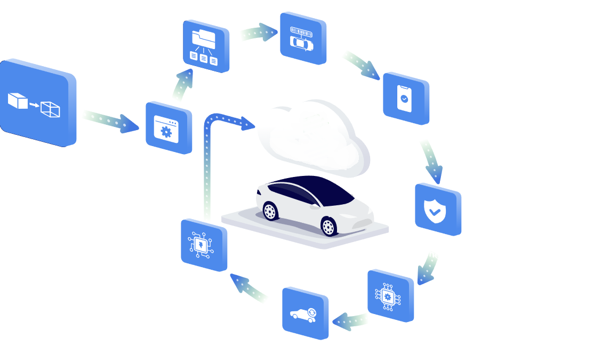
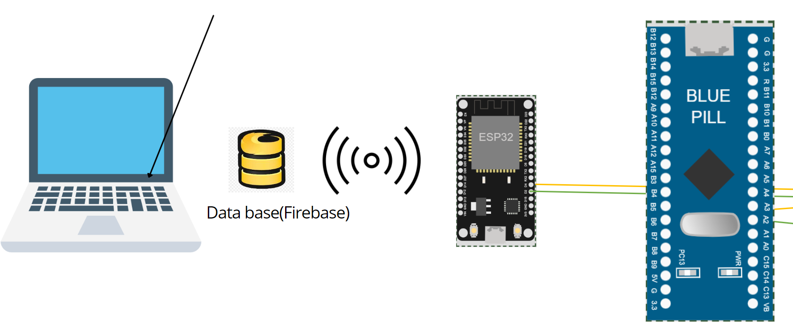

# FOTA Project with ESP8266 and STM32F103

This project enables remote firmware updates (FOTA) using ESP8266, STM32F103, and Google Firebase. The ESP8266 connects to WiFi, downloads the bootloader and firmware code, and communicates with the STM32.

<div style="text-align: right; padding-right: 30px;">
  
</div>

## Table of Contents

- [1. Introduction](#1-introduction)
- [2. Software Interfaces](#2-software-interfaces)
- [3. Critical Parts](#3-critical-parts)
- [4. How to Use](#4-how-to-use)

---

## 1. Introduction

This project facilitates firmware updates over-the-air (FOTA) for an STM32F103 microcontroller using an ESP8266 and Google Firebase. Key components include WiFi connectivity, Firebase authentication, and MQTT communication.


<div style="text-align: right; padding-right: 30px;">
  
</div>


## 2. Software Interfaces

This section provides an overview of the primary functions and interfaces used in this project.

### MQTT Callback

- **Function**: `callback(char* topic, byte* payload, unsigned int length)`
- **Purpose**: Handles incoming MQTT messages.
- **Hint**: Parses MQTT topic and payload to trigger actions based on received messages.

### Firebase Storage Callback

- **Function**: `fcsDownloadCallback(FCS_DownloadStatusInfo info)`
- **Purpose**: Callback function for Firebase Storage downloads.
- **Hint**: Provides status updates during file downloads from Firebase Storage.

### Application Jump

- **Function**: `Bootloader_Jump_To_Application()`
- **Purpose**: Jumps to the main application in the STM32.
- **Hint**: Resets and initiates the main application.

## 3. Critical Parts

This section highlights key components and functionalities in the code.

### Firebase Integration

- **Code**: 
    ```cpp
    Firebase.begin(&config, &auth);
    ```
- **Explanation**: Initializes Firebase with authentication credentials and configuration.

### MQTT Subscription

- **Code**: 
    ```cpp
    client.subscribe("/FOTA/");
    ```
- **Explanation**: Subscribes to the MQTT topic for receiving commands.

### Firmware Update Process

- **Code**: 
    ```cpp
    if (!Firebase.Storage.download(&fbdo, STORAGE_BUCKET_ID, "TestBootloader.bin", "/updat.bin", mem_storage_type_flash, fcsDownloadCallback))
    ```
- **Explanation**: Initiates the firmware download process from Firebase Storage.

### Flash Memory Erasure

- **Code**: 
    ```cpp
    Bootloader_Erase_Flash(BL_HostBuff);
    ```
- **Explanation**: Initiates erasing of flash memory in response to a command from the host.

### Flash Memory Write

- **Code**: 
    ```cpp
    Bootloader_Memory_Write(BL_HostBuff);
    ```
- **Explanation**: Writes data to flash memory, including address verification and CRC checks.

---
Here's how to flash the code and clear it:
- GUI.
<div style="text-align: right; padding-right: 30px;">
  
</div>


